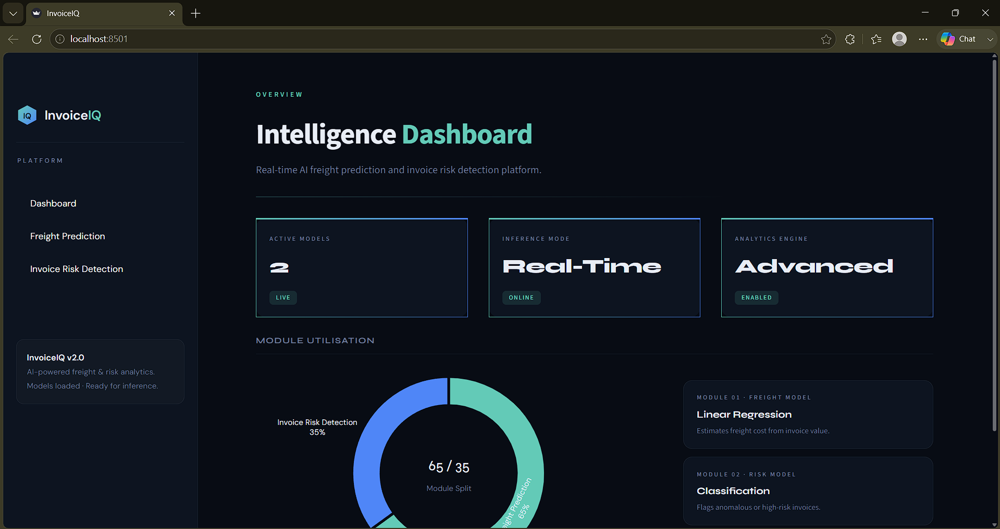
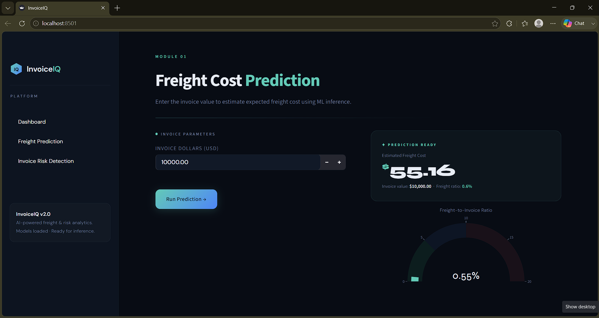
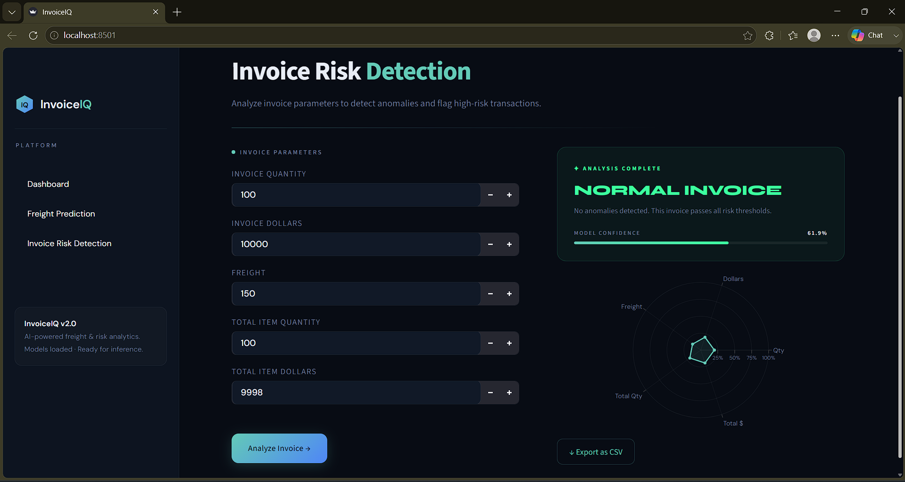

<div align="center">

<br/>

```
  ⬡  InvoiceIQ
```

# Invoice**IQ**

### AI-Powered Freight Cost Prediction & Invoice Risk Detection Platform

<br/>

[](https://python.org)
[](https://streamlit.io)
[](https://scikit-learn.org)
[](https://plotly.com)
[](LICENSE)
[]()

<br/>

> *Turn raw invoice data into actionable intelligence — in real time.*

<br/>

---

</div>

## ⬡ &nbsp;What is InvoiceIQ?

**InvoiceIQ** is a production-grade, AI-powered analytics platform that brings machine learning directly into supply chain finance workflows. It solves two critical business problems simultaneously:

- **Freight Cost Overruns** — Predict what freight *should* cost before it's billed, catching overcharges before they hit your books.
- **Invoice Fraud & Anomalies** — Classify every invoice as normal or high-risk using a trained ML model, with confidence scoring and a full parameter fingerprint.

Built entirely with open-source tools and deployable in minutes, InvoiceIQ wraps serious ML capability in a clean, enterprise-grade UI — no data science background required to operate.

<br/>

---

## ✦ &nbsp;Key Features

| Module | Capability | Output |
|--------|-----------|--------|
| **Dashboard** | System overview, model status, module utilisation | Donut chart · KPI cards · Model info |
| **Freight Prediction** | Predict freight cost from invoice dollar value | Dollar estimate · Freight-to-invoice ratio gauge |
| **Invoice Risk Detection** | Classify invoice as Normal or High Risk | Risk card · Confidence bar · Radar fingerprint · CSV export |

### Why it stands out

- **Real-time ML inference** — sub-second predictions via `joblib`-cached models
- **Confidence scoring** — every risk prediction ships with a probability score
- **Parameter Fingerprint** — radar chart visualising all 5 invoice dimensions, colour-coded by risk outcome (teal = safe · red = high risk)
- **Freight-to-Invoice Ratio gauge** — instantly readable signal for cost anomaly detection
- **One-click CSV export** — audit-ready output with risk label and confidence appended
- **Premium dark UI** — custom Streamlit theme with Syne + DM Sans typography, zero default chrome

<br/>

---

## 🗂 &nbsp;Project Structure

```
INVOICE_INTELLI.../
│
├── app.py                                   ← Main Streamlit application
├── requirements.txt
├── .gitignore
├── README.md
│
├── assets/
│   └── screenshots/                         ← UI screenshots for README
│       ├── dashboard.png
│       ├── freight_prediction.png
│       └── invoice_risk.png
│
├── freight_cost_prediction/                 ← Freight cost ML pipeline
│   ├── models/                             ← Serialised model artefacts
│   │   └── predict_freight_model.pkl       ← Trained regression model
│   ├── data_preprocessing.py               ← Feature engineering & cleaning
│   ├── train.py                            ← Model training script
│   └── model_evaluation.py                 ← Evaluation metrics & reporting
│
├── invoice_flagging/                        ← Invoice risk ML pipeline
│   ├── models/                             ← Serialised model artefacts
│   │   ├── predict_flag_invoice.pkl        ← Trained classification model
│   │   └── scaler.pkl                      ← StandardScaler for normalisation
│   ├── data_preprocessing.py               ← Feature engineering & cleaning
│   ├── train.py                            ← Model training script
│   └── model_evaluation.py                 ← Evaluation metrics & reporting
│
├── inference/                               ← Standalone inference scripts
│   ├── predict_freight.py                  ← Run freight cost prediction
│   └── predict_invoice_flag.py             ← Run invoice risk classification
│
└── notebooks/                               ← Exploratory & training notebooks
    ├── Invoice_Flagging.ipynb              ← Risk model development
    └── Predicting_Freight_Cost.ipynb       ← Freight model development
```

<br/>

---

## 🤖 &nbsp;ML Models

### Module 01 · Freight Cost Prediction

| Attribute | Detail |
|-----------|--------|
| **Type** | Regression |
| **Algorithm** | Linear Regression |
| **Input feature** | `Dollars` (invoice value in USD) |
| **Output** | Predicted freight cost (USD) |
| **Secondary metric** | Freight-to-invoice ratio (%) |

The model learns the statistical relationship between invoice value and freight cost from historical shipment data. The ratio gauge additionally zones the prediction into low / moderate / high freight-intensity bands.

---

### Module 02 · Invoice Risk Detection

| Attribute | Detail |
|-----------|--------|
| **Type** | Binary Classification |
| **Preprocessing** | `StandardScaler` (zero mean, unit variance) |
| **Input features** | `invoice_quantity`, `invoice_dollars`, `Freight`, `total_item_quantity`, `total_item_dollars` |
| **Output** | `0` = Normal · `1` = High Risk |
| **Confidence** | `predict_proba` max probability × 100 |

Five invoice-level signals are normalised and passed to the classifier. The model outputs a binary label plus a confidence score; a radar chart then maps all five normalised inputs for visual audit.

<br/>

---

## ⚙️ &nbsp;Installation & Setup

### Prerequisites

- Python **3.9+**
- pip

### 1 · Clone the repository

```bash
git clone https://github.com/your-username/invoiceiq.git
cd invoiceiq
```

### 2 · Create a virtual environment

```bash
python -m venv venv

# macOS / Linux
source venv/bin/activate

# Windows
venv\Scripts\activate
```

### 3 · Install dependencies

```bash
pip install -r requirements.txt
```

### 4 · Add your trained models

Place your serialised model files at the exact paths below:

```
freight_cost_prediction/models/predict_freight_model.pkl
invoice_flagging/models/predict_flag_invoice.pkl
invoice_flagging/models/scaler.pkl
```

> **Note:** The app uses `@st.cache_resource` so models are loaded once and held in memory across all sessions — no repeated cold-start overhead.

### 5 · Launch

```bash
streamlit run app.py
```

Open [http://localhost:8501](http://localhost:8501) in your browser.

<br/>

---

## 📦 &nbsp;Dependencies

```txt
streamlit>=1.28.0
pandas>=1.5.0
scikit-learn>=1.2.0
joblib>=1.2.0
plotly>=5.15.0
```

Generate a `requirements.txt` automatically:

```bash
pip freeze > requirements.txt
```

<br/>

---

## 🖥 &nbsp;UI Overview

### Dashboard
The landing page gives an at-a-glance system status — active model count, inference mode, and a donut chart breaking down module utilisation (65% Freight Prediction · 35% Risk Detection). Model architecture cards sit alongside the chart.

<div align="center">
  
  <br/><sub>Intelligence Dashboard — KPI cards, module utilisation donut chart & model info</sub>
</div>

<br/>

### Freight Prediction
Enter an invoice value and hit **Run Prediction →**. The right panel instantly renders:
- Large-format dollar cost estimate
- Inline freight-to-invoice ratio
- A colour-banded gauge chart (green → blue → red zones)

<div align="center">
  
  <br/><sub>Module 01 — Freight Cost Prediction with ratio gauge</sub>
</div>

<br/>

### Invoice Risk Detection
Fill in the five invoice parameters and hit **Analyze Invoice →**. Results render as:
- Colour-coded risk card (teal border for Normal · red border for High Risk)
- Animated confidence progress bar
- 5-axis radar chart ("Parameter Fingerprint") — teal fill for safe, red fill for risk
- Downloadable CSV with risk label and confidence score appended

<div align="center">
  
  <br/><sub>Module 02 — Invoice Risk Detection with parameter fingerprint radar</sub>
</div>

<br/>

---

## 🎨 &nbsp;Design System

InvoiceIQ ships with a fully custom Streamlit theme. All Streamlit default chrome is suppressed and replaced with a hand-crafted dark design system.

| Token | Value | Usage |
|-------|-------|-------|
| `--bg` | `#080C14` | App background |
| `--surface` | `#0D1420` | Cards, sidebar |
| `--accent` | `#63CAB7` | Teal — primary accent, safe state |
| `--accent2` | `#4F86F7` | Blue — gradient pair |
| `--danger` | `#FF5A5A` | Red — high risk state |
| `--success` | `#3DFFA0` | Green — confirmation |
| `--text` | `#E8EDF5` | Body text |
| `--muted` | `#6B7A99` | Labels, captions |

**Typography:** [Syne](https://fonts.google.com/specimen/Syne) (display / headings) + [DM Sans](https://fonts.google.com/specimen/DM+Sans) (body / UI)

<br/>

---

## 🗺 &nbsp;Roadmap

- [ ] Batch invoice upload (CSV → bulk risk scoring)
- [ ] Historical prediction log with trend charts
- [ ] Model performance metrics dashboard (accuracy, precision, recall)
- [ ] REST API wrapper (FastAPI) for programmatic access
- [ ] Role-based access control (admin / analyst / viewer)
- [ ] Streamlit Cloud / Docker deployment guide

<br/>

---

## 🤝 &nbsp;Contributing

Contributions are welcome. To get started:

```bash
# Fork the repo, then:
git checkout -b feature/your-feature-name
git commit -m "feat: describe your change"
git push origin feature/your-feature-name
# Open a Pull Request
```

Please follow [conventional commits](https://www.conventionalcommits.org/) and keep PRs focused on a single concern.

<br/>

---

## 📄 &nbsp;License

This project is licensed under the **MIT License** — see the [LICENSE](LICENSE) file for details.

<br/>

---

<div align="center">

Built with Python · Streamlit · scikit-learn · Plotly

<br/>

*If this project helped you, consider giving it a ⭐ on GitHub.*

</div>
